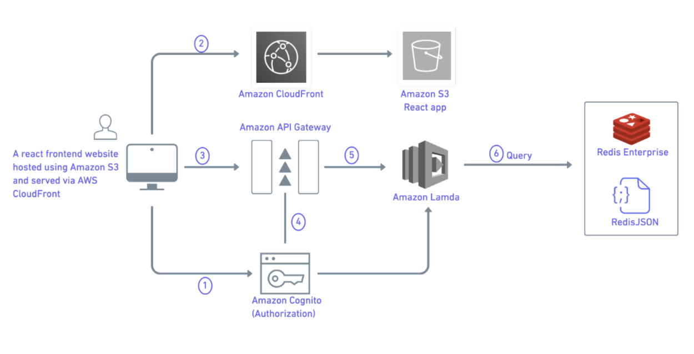

# Building a Next Generation Digital Auction SaaS Platform using React, AWS Lambda  and Redis

This application allow users to attend and take part in digital auctions. It allows users to create an account, put in bids and even set up their own auction. 

## Features

- A multi-tenant platform where the auctioneer can signup, set up bidding and conduct auctions.
- Any authorized user can place bids and view the bidding updates realtime.
- Dynamic auction closing based on last bid time.
- Auctioneer signup and set up the site's look and feel.
- Create new auctions (specify minimum bid amount, bid increment, slot start and end time, etc.)
- User - Signup, Sign in and Forgot Password
- View all Auctions & Place Bid
- Real time updates for Biddings placed by various users

## Architecture

## Tech Stack

- [NodeJS as a Backend](https://nodejs.org/en/): used as an open-source, cross-platform, backend JavaScript runtime environment that executes Javascript code outside a web browser.
- [Amazon Cognito for Authentication](https://aws.amazon.com/es/cognito/): used to securely manage and synchronize app data for users on mobile.
- [Redis Enterprise Cloud as a Database ](https://redis.com/redis-enterprise-cloud/overview/): used as a real-time database, cache, and message broker
- [RedisJSON as a Redis Module](https://oss.redis.com/redisjson/#:~:text=RedisJSON%20is%20a%20Redis%20module,from%20Redis%20keys%20(documents).&text=Documents%20are%20stored%20as%20binary,fast%20access%20to%20sub%2Delements): used to store, update and fetch JSON values from Redis keys.  
- [Socket.IO for Real-time Event Handling](https://socket.io/docs/v4/): used as a library that provides real-time, bi-directional and event-based communication between the browser and the server. 
- [AWS Lambda for Compute](https://aws.amazon.com/es/lambda/): used a serverless compute service that runs your code in response events and manages the underlying compute service automatically for you.
- [Amazon SNS/Amazon SES for Notification](https://aws.amazon.com/sns/): a fully managed messaging service for both application-to-application (A2A) and application-to-person (A2P) communication.

## How it Works
### How the data is stored
* We are using Redis Cloud Database equipped with RedisJSON module for storing data.
   * Auctions
     * type - Redis Hash 
     * used for storing auctions' data. 
     * UUID generated from backend serves as the key.
     * JSON data which includes keys - auctionId, auctionItemName, description,lotNo, quantity, buyersPremium, itemUnit, minBidAmount, bidIncrement, startDateTime, endDateTime, images, currentBid - servers as the value for Auctions hash.   
     * NodeJS connects to Redis Cloud database. Frontend communicates with NodeJS backend through API calls.
     * POST : /api/auctions
     * request body has JSON data to be inserted to database.
     * NodeJS uses 'redis' module to work with Redis Cloud. The redis client is created using the Redis credentials and hmset() equivalent of HMSET command is used to push data to Redis database.       
   * Biddings
     * type - Redis Hash  
     * used for storing biddings placed on each auction item
     * NodeJS connects to Redis Cloud database. Frontend communicates with NodeJS backend through API calls.
     * POST : /api/bidding
     * request body has JSON data to be inserted to database.
     * AuctionId from request body servers as the key
     * JSON data which includes keys - currentBid, currentBidTime, currentBidEndTime,  and biddings array (id, auctionId, userId, username, bidAmount, bidTime) - servers as value
     * Bidding array has all the biddings placed for a particular auction item
     * Based on current BidEndTime and BidTime - Auction end date is extended based on Dynamic Closing concept. 
     * Current Dynamic closing logic - If a new bid is placed within the last 5 mins of auction end time, the end time is extended by 1 hour.
     * This will be configurable in the SaaS solution.
     * NodeJS uses 'redis' module to work with Redis Cloud. The redis client is created using the Redis credentials and hmset() equivalent of HMSET command is used to push data to Redis database.
   * ProfileSettings
     * type - string
     * JSON data which includes keys - - serves as value 
     * NodeJS connects to Redis Cloud database. Frontend communicates with NodeJS backend through API calls.
     * POST : /api/settings
     * request body has JSON data to be inserted to database.
     * NodeJS uses 'redis' module to work with Redis Cloud. The redis client is created using the Redis credentials and set() equivalent of SET command is used to push data to Redis database.
   * Users
     * type - Redis Hash
     * used for storing user details
     * NodeJS connects to Redis Cloud database. Frontend communicates with NodeJS backend through API calls.
     * POST : /api/users
     * request body has JSON data to be inserted to database.
     * email id serves as the key
     * JSON data which includes keys -- serves as value
     * NodeJS uses 'redis' module to work with Redis Cloud. The redis client is created using the Redis credentials and hmset() equivalent of HMSET command is used to push data to Redis database. 

### How the data is accessed
  * All auctions
      * NodeJS connects to Redis Cloud database. Frontend communicates with NodeJS backend through API calls.
      * GET : /api/auctions fetches all the keys from Auctions Hash
      * NodeJS uses 'redis' module to work with Redis Cloud. The redis client is created using the Redis credentials and hmget() equivalent of HMGET command is used to get data from Redis database.
  * Each auction
      * GET : /api/auctions/{auctionId} fetches each auction item by id
      * NodeJS uses 'redis' module to work with Redis Cloud. The redis client is created using the Redis credentials and hmget() equivalent of HMGET command is used to get data from Redis database.
  * All bidding data of an auction item
      * GET : /api/bidding/{auctionId}
      * NodeJS uses 'redis' module to work with Redis Cloud. The redis client is created using the Redis credentials and hmget() equivalent of HMGET command is used to get data from Redis database.
  * Profile settings
      * GET : /api/settings
      * NodeJS uses 'redis' module to work with Redis Cloud. The redis client is created using the Redis credentials and get() equivalent of GET command is used to get data from Redis database.
  * User info
      * GET : /api/users/{email}
      * NodeJS uses 'redis' module to work with Redis Cloud. The redis client is created using the Redis credentials and hmget() equivalent of HMGET command is used to get data from Redis database.

## Getting Started 

Installation steps:

### Prerequisites

- Node JS
- NPM

* To run the App,  
    **1.** npm install. 
    **2.** npm build. 
    **3.** npm start. 

## App Details

* Screenshots  
  * Home page
    
  * SignUp
    
  * SignIn
    
  * Dashboard
    
  * Auction Items
    
  * Bidding Page
    
  * Bidding Realtime Updates
    
